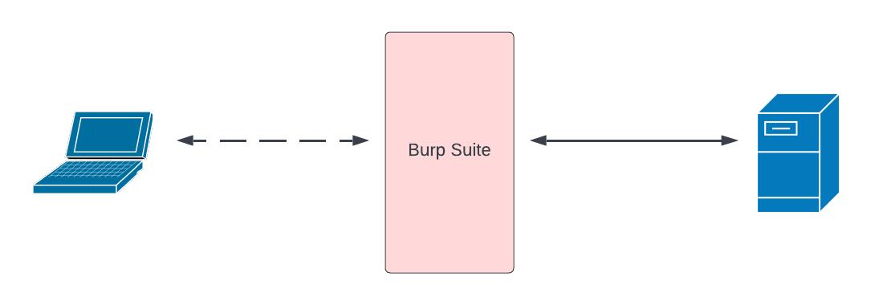

#  Burp Suite - Getting Started

## Configure External Browser to Proxy through Burp Suite
### Challenge 1: Configure Firefox ESR to proxy through Burp Suite
Kali Linux deploys with Firefox ESR. Firefox, as well as other browsers, can be configured to forward HTTP/HTTPS traffic through a proxy. However, procedures to configure proxying are browser specific. Instructions for Chrome, Firefox, Safari and Internet Explorer (IE) are provided by [PortSwigger](https://portswigger.net/burp/documentation/desktop/external-browser-config), Burp Suite's developer. 
Configure Firefox in Kali Linux using [these instructions](https://portswigger.net/burp/documentation/desktop/external-browser-config/browser-config-firefox) to proxy through Burp Suite. This will configure Firefox to proxy all protocols through Burp Suite. In this case, all protocols refers to HTTP and HTTPS. HTTP would be proxied through Burp Suite by default. Selecting the check box for "**Use this proxy server for all protocols**" instructs Firefox to proxy HTTPS in addition to HTTP.

## Install Burp's CA Certificate.
### Challenge 2: Install Burp's CA certificate in Firefox
Burp Suite includes an internal browser. The internal browser includes Burp's CA certificate and will by default trust Burp. However, we are configuring an external browser, which by default will not trust Burp. Burp's CA certificate must be installed in Firefox to allow Firefox to trust Burp. Figure 1 illustrates how HTTPS works with Burp Suite. The client establishes an HTTPS connection with Burp. The user can modify the HTTPS request in Burp then forward the request to the web server. A new HTTPS connection is established between Burp and the web server. There is not direction HTTPS session between the client and web server. Instead, **there are two independent HTTPS sessions: one between Burp and the client and a second between Burp and the web server**. 

Figure 1, Burp Suite Proxy

As a result of the proxying, Burp authenticates the web server and the client authenticates Burp. However, since Burp creates its own CA certificate, the client browser will not trust Burp. Burp's CA certificate needs to be installed in the browser. PortSwigger provides detailed instructions to install Burp's CA certificate for Chrome, Firefox, Safari and IE. Use the [Firefox instructions](https://portswigger.net/burp/documentation/desktop/external-browser-config/certificate/ca-cert-firefox) to install Burp's CA certificate in Kali's Firefox browser.

### Challenge 3: Configure Target and Scope
Burp captures can get very noisy. Traffic captures can be limited to the URLs of interest. The following challenge will have you browse to [https://portswigger.net/web-security](https://portswigger.net/web-security). Configure Burp to restrict HTTP/S captures to that site.

Select **Target** > **Scope**. Under **Include in Scope**, click **Add**. Add the URL https://portswigger.net/web-security to the pop-up box, click **OK**. A second pop-up will ask if out-of-scope items (requests not going to PortSwigger) should **not** be sent to Burp tools. Click **Yes**.

### Challenge 4: Capture your first HTTPS request
Challenges 1 and 2 are prerequisites to Challenge 3. Therefore, successfully capturing an HTTPS request demonstrates that the browser is correctly configured. Start Burp and go to the **Proxy > Intercept** tab. Click the button **Intercept is on**. The button will toggle to **Intercept is off**. Next, click **HTTP history**. Click the **#** column to sort requests in descending order. Descending order places the most recent request at the top of HTTP history.

In Firefox, browse to [PortSwigger Academy](https://portswigger.net/web-security). Select the first HTTP GET request for https://portswigger.net/web-security. 

**Capture a screenshot show the HTTP GET request and response.** 

### Challenge 4: Capture sensitive data
PortSwigger includes free and paid labs and training. The free labs are an excellent way to learn Burp. Create an account. 
1. Click the button **Signup**.
2. Copy the URL https://portswigger.net/users/register and add to Scope. 
3. Create your account.

Return to  Burp **Proxy** > **HTTP hisotry** and find the **POST** request to **/users/register**. Examine line 17. Find the POST parameter EmailAddress= and observe the email address you submitted in the registration form.

**Capture a screenshot show the HTTP POST request and response.**
