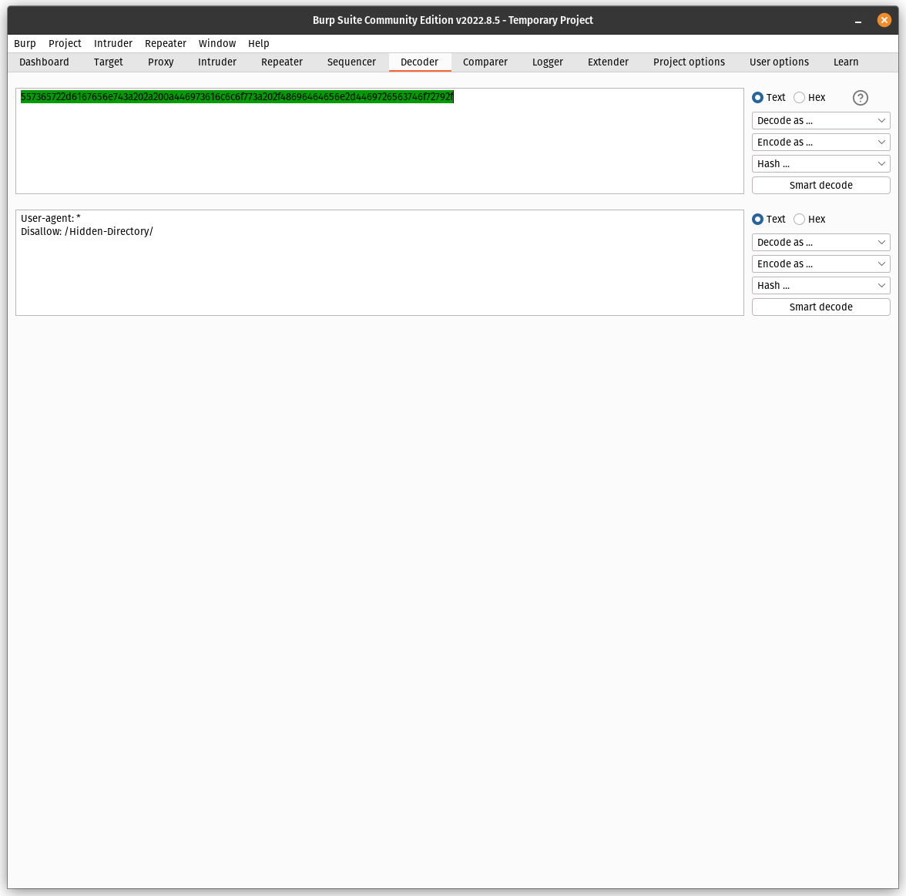
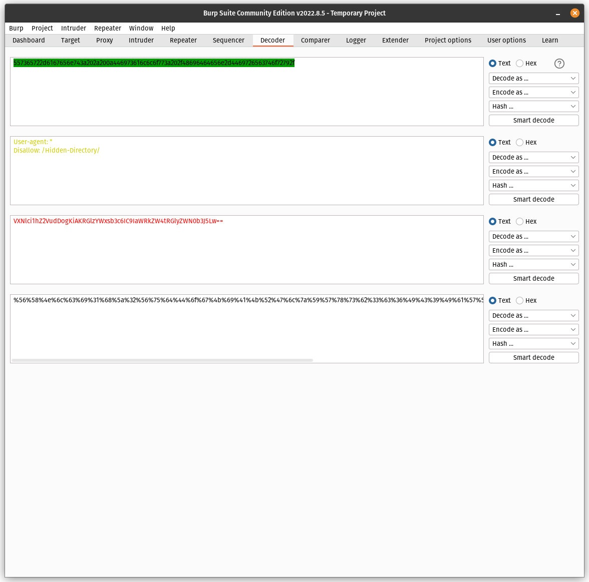

#  Burp Suite - Decoder and Comparer Tools

## Understanding deploy.sh
Deploy a testing environment using Docker containers. A bash script that automates the deployment of the lab environment is provided [here](https://github.com/kabarton62/cybersec-tools-II/blob/main/burpsuite/exercise3-deploy.sh). Start by reviewing the bash script.
Lines 1 through 3 include the **shebang (#!/bin/bash)** and define two variables, **$docker** and **$compose**. The shebang must be the first line.
```
#!/bin/bash
docker='/usr/bin/sudo /usr/bin/docker'
compose='/usr/bin/sudo /usr/bin/docker-compose'
```
The shebang declares the executable used to run the shell. With the shebang, the script could be given file permissions for execution and the script would execute using bash. Alternatively, the script could be executed with the bash command. See the two examples below.
```
# deploy.sh is not executable
user@server:~/burp3x$ ls -l
-rw-rw-r-- 1 kbarton kbarton 4782 Oct 17 14:44 deploy.sh

# change file permissions to make deploy.sh executable
user@server:~/burp3x$ chmod 755 deploy.sh 

# demonstrate that deploy.sh is executable
user@server:~/burp3x$ ls -l
-rwxr-xr-x 1 kbarton kbarton 4782 Oct 17 14:44 deploy.sh

# execute deploy.sh using two methods
user@server:~/burp3x$ ./deploy.sh
user@server:~/burp3x$ bash deploy.sh
```
Either technique will execute a bash script, but there is a nuanced difference between the two techniques. Executing the script with a bash command (bash deploy.sh) does not require the script to have execution permissions or the shebang in the script. The shebang is still useful to quickly identify the type of script, but it is not necessary to execute the script.

The variables $docker and $compose are used for simplicity. Docker and docker-compose require root privileges or a user in the docker group. Therefore, sudo is run with the docker and docker-compose commands throughout the script. Using full filepaths is a good security practice. The docker and docker-compose commands are used multiple times in the scripts. Defining variables for **/usr/bin/sudo /usr/bin/docker** and **/usr/bin/sudo /usr/bin/docker-compose** is completely optional but makes for a lot less typing.

Additional variables are defined for filenames, hostnames, and other details that are used throughout the script. Some of these variables are used multiple times. Defining variables reduces chances for errors and makes it easier to change these details at a later time. Variables must be defined before they are used. Placing them near the beginning of the script is not mandatory, but can help make the script easier to read.

```
f=docker-compose.yml
web='php:7.0-apache'
mysql='mysql:5'
wname='burp3-web'
hostname='chickenHouse'
sqlname='burp3-mysql'
sqlcommand='/usr/bin/mysql -u root -proot'
dir1='X8XFasTDNK'
dir2='softblue'
dir3='blue'
dir4='UTLanVxNGYZYL'
webip='172.19.4.3'
sqlip='172.19.4.4'
port='8500'
```

The last set of variables defines colors used to highlight text when the script runs. Specifically, these variables define the start and stop of red text when we print comments during script execution.

```
RED='\033[0;31m'
NC='\033[0m'
```

Previous exercises did not require docker-compose, so deploy.sh first ensures docker-compose is installed.
```

/usr/bin/sudo /usr/bin/apt update
/usr/bin/sudo /usr/bin/apt install docker-compose
```

The script uses docker-compose to deploy two containers, a web server and a mysql server. Docker-compose requires a configuration file to deploy the containers and network. Although alternative filenames can be used, docker-compose looks for the file docker-compose.yml by default. The script uses a here-document to create docker-compose.yml. Notice that the docker-compose.yml file uses some of the variables defined at the beginning of the script, including container names, docker-compose.yml filename, port to bind http, and IP addresses for the containers. The mysql root user password is also defined in docker-compose.yml, and could be changed by modifying the enviroment value for MYSQL_ROOT_PASSWORD.

```
# Create docker-compose.yml
cat << EOF > $f
version: '2'
services:
 web:
   container_name: $wname
   image: $web
   hostname: $hostname
   depends_on:
    - mysql
   ports:
    - "$port:80"
   networks:
     burpbr:
       ipv4_address: $webip
 mysql:
   container_name: $sqlname
   image: $mysql
   environment: 
    - MYSQL_ROOT_PASSWORD=root
   networks: 
     burpbr:
       ipv4_address: $sqlip
networks:
  burpbr:
    driver: bridge
    ipam:
     config:
       - subnet: 172.19.4.0/24
         gateway: 172.19.4.1
EOF
```

The following command deploys the containers using docker-compose.
```
# Deploy the containers
$compose up -d 
```

Next, we create robots.txt with a here-document and copy it to the webroot in the web server.

```
# Create robots.txt and transfer to web server

cat << EOF > robots.txt
Ascii hex: so stupid
557365722d6167656e743a202a200a446973616c6c6f773a202f58385846617354444e4b2f
EOF

$docker cp robots.txt $wname:/var/www/html/robots.txt
```

Next, we install some packages in the web server (unzip, wget), download and extract File Thingie, and configure File Thingie. Note, the **printf** command is used to print a couple of comments showing actions being completed in the script. These are informational but could help us troubleshoot the script if we had problems executing the script.
```
# Prepare web server container. Install unzip, mysql-client, and download applications.
printf "\n${RED}Preparing the web server. Installing packages and applications.${NC}\n\n"

$docker exec -it $wname apt update 
$docker exec -it $wname apt install unzip wget -y
$docker exec -it $wname cd /
$docker exec -it $wname wget https://www.exploit-db.com/apps/71442de71ef46bf3ed53d416ec8bcdbd-filethingie-master.zip
$docker exec -it $wname unzip *.zip 
$docker exec -it $wname mv filethingie-master/ /var/www/html/$dir1/ 
$docker exec -it $wname rm 71442de71ef46bf3ed53d416ec8bcdbd-filethingie-master.zip 

# Configure filethingie index.php, admin user and password
printf "\n${RED}Configure File Thingie and create a password for the admin user.${NC}\n\n"

$docker exec -it $wname cp /var/www/html/$dir1/ft2.php /var/www/html/$dir1/index.php
$docker exec -it $wname cp /var/www/html/$dir1/config.sample.php /var/www/html/$dir1/config.php
$docker exec -it $wname sed -i 's/define("USERNAME", "")/define("USERNAME", "admin")/g' /var/www/html/$dir1/config.php
$docker exec -it $wname sed -i 's/define("PASSWORD", "")/define("PASSWORD", "24408ce3f09b31f9d3454ee6ea81bb63")/g' /var/www/html/$dir1/config.php
$docker exec -it $wname chown -R www-data:www-data /var/www/html/$dir1
```

The remainder of the script creates additional directories and index files for each directory, then copies those index files to each directory. Examples of two index files are shown below.

```
cat << EOF > webroot-index.html
<!DOCTYPE html>
<html>
<body>
<h2>Find things first</h2>
</body>
</html>
EOF

$docker cp webroot-index.html $wname:/var/www/html/index.html

cat << EOF > $dir2-index.html
<!DOCTYPE html>
<html>
<body>
<h2>base64</h2>
<p>Base64 Encoded: decode it.
UW1GelpUWTBJR2x6SUhOdklHVmhjM2tnZEc4Z1kzSmhZMnM9
</body>
</html>
EOF

$docker exec -it $wname mkdir /var/www/html/$dir2
$docker cp $dir2-index.html $wname:/var/www/html/$dir2/index.html
```

## Build the Lab with deploy.sh
Now that we understand what deploy.sh does, create deploy.sh on your Ubuntu server and execute the script to build the lab. Deploy.sh depends on Docker compute engine and docker-compose. Install those dependencies if they are not already installed. A script to install the required dependencies is provided [here](https://github.com/kabarton62/cybersec-tools-II/blob/main/install.sh).

1. Create a directory to store files for the lab and change directories to that new directory. 
2. Use a text editor of your choice to create deploy.sh on your Ubuntu server. Copy and paste [the bash script from GitHub ](https://github.com/kabarton62/cybersec-tools-II/blob/main/burpsuite/exercise3-deploy.sh) to **deploy.sh** on your Ubuntu server. 
3. Finally, execute deploy.sh. The following illustrates the lab being built. Note that several files are created in the directory where deploy.sh is executed (i.e., burp3/).

```
user@server:~$ mkdir burp3 && cd burp3/
user@server:~/burp3$ nano deploy.sh

user@server:~/burp3$ bash deploy.sh 
Creating network "burp3_burpbr" with driver "bridge"
Pulling web (php:7.0-apache)...
7.0-apache: Pulling from library/php
177e7ef0df69: Pull complete
9bf89f2eda24: Pull complete
350207dcf1b7: Extracting [=================================================> ]  66.85MB/67.44MB
a8a33d96b4e7: Download complete
c0421d5b63d6: Download complete
f76e300fbe72: Download complete
af9ff1b9ce5b: Download complete
d9f072d61771: Download complete
37007e292198: Download complete
8ba923990f24: Download complete
98af8902979a: Download complete
f1548c2cd376: Download complete
e1062fd0605a: Download complete
Status: Downloaded newer image for php:7.0-apache
Creating burp3-mysql ... done
Creating burp3-web   ... done

---- TRUNCATED -----

user@server:~/burp3$ ls
UTLanVxNGYZYL-index.html  customWordlist.txt  docker-compose.yml  softblue-index.html
blue-index.html           deploy.sh           robots.txt          webroot-index.html
```

## Burp Suite Decoder Tool
### Challenge 1: Decode ASCII hex
[Burp Suite Decoder tool](https://portswigger.net/burp/documentation/desktop/tools/decoder) encodes and decodes data to/from URL, HTML, Base64, ASCII hex, hexadecimal, octal, binary and gzip. Typically, this transforms text data but it can also be used to tranform binary data. Encoded data may not be human readable, but it just encoded, not encrypted. Encryption makes data unreadable with decryption and the required key. Encryption is secure. Encoded data can be decoded simply by running the encoded data through the appropriate algrorithm, but decoding does not require a key.

Burp Suite Decoder tool also performs hashing. Hashing functions are one-way lossy compression functions that create a fixed length _hash value_ that is a fignerprint of the input message. Hash values cannot be decoded to recover the original message. Hash functions are lossy, meaning that the original message cannot be calculated from the hash value.

Two methods are available to send data to Decoder. First, data can be typed or pasted to Decoder. Second, data can be selected in either an HTTP Request or Response using Intercept, HTTP History, Repeater or other Burp Suite tools, right clicking and using Send to Decoder. Figure 1 illustrates decoding ASCII hex.



**Figure 1, Burp Suite Decoder**

Multiple rounds of encoding/decoding can be performed and data can be modified before or after encoding/decoding. Figure 2 illustrates
1. decoding ASCII hex
2. encoding the result of round 1 as Base64
3. encoding the result of round 2 as URL



**Figure 2, Burp Suite Decoder - Multiple Rounds**

### Challenge 1: ASCII Hex
Examine robots.txt in the web root. The contents are obviously not text. Although the encoding is not obvious, it also does not look like URL, HTML or Base64 encoding. One approach is to just send the string to Decoder and attempt to decode the string with various algorithms. 
1. Find the HTTP Response in Burp Suite's HTTP history. 
2. Select the encoded string 
3. Right-click the encoded string and click **Send to Decoder**
4. Select Decoder and confirm the encoded string is present
5. Click **Decode as ...** and **ASCII hex**

**Capture a screenshot of the decoded string.**

### Challenge 2: Hash Functions
Challenge 1 discloses a directory. Browse to that directory and crack the **admin** password. The catch is that the system admin was concerned about storing plaintext passwords in the application, so she hashed the password before storing it. The password is in customWordlist.txt. Crack the password.

Use Payload Processing in the Intruder tool to complete the password attack.
1. Under Payload Processing, click **Add**
2. Select **Rule Type** > **Hash** > **MD5** > **OK**
3. Start the attack

**Report the plaintext and hash for the passowrd.**

### Challenge 3: Base64, URL and HTLML 
Use dirb and dirbuster to discover additional directories. Two directories can be discovered with directory enumeration wordlists in Kali. Decode the strings discovered in the index files.

**Report the discovered directories and plaintext strings decoded from the index files.**

### Challenge 4: Discover Hidden Resources
The system administrator attempted to hide a file by using a md5 hash value as part of the file name. The file extension is .html, but the filename has been changed to a hash value of a password in customWordlist.txt.

1. Browse to http://ip-address:8500/UTLanVxNGYZYL/
2. Note that you receive a permission denied response. The directory does not have an index file (i.e., index.html). You must browse to an existing resource in that directory to get a response. The successful URL will look something like http://ip-address:8500/UTLanVxNGYZYL/fea0f1f6fede90bd0a925b4194deac11.html. 
3. Find the hidden file and decode the content.

**Report the URL to the hidden file and plaintext of the file content.**

## Burp Suite Comparer Tool
The [Burp Suite Comparer tool](https://portswigger.net/burp/documentation/desktop/tools/comparer) compare and highlights the difference between any two data items. For example, consider a password attack against some web application that has a nuanced difference between successful and failed login attempts. Spotting the successful login attempt from manual examination may be difficult. Comparer would highlight the difference between a successful and failed attempt. A web application tester could use the results to improve testing processes.

### Challenge 5: Compare Failed and Successful Login Attempts
You executed a password attack against a web application in Challenge 2, Hash Functions. The successful password was a hash value of a password from customWordlist.txt. You discovered the plaintext password and the password hash. Login attempts using the plaintext password will result in failed attempts, login attempts with the password hash will be successful. 
1. Attempt to login with both the plaintext password and the password hash. 
2. Send reponses from both attempts to **Comparer**.
3. Select the **Comparer** tab.
4. Under **Compare**, select **Words**.
5. Summarize the content in the two responses reported as **Modified**, **Deleted**, and **Added**. Explain the indicators of a successful login attempt vs a failed login attempt.
