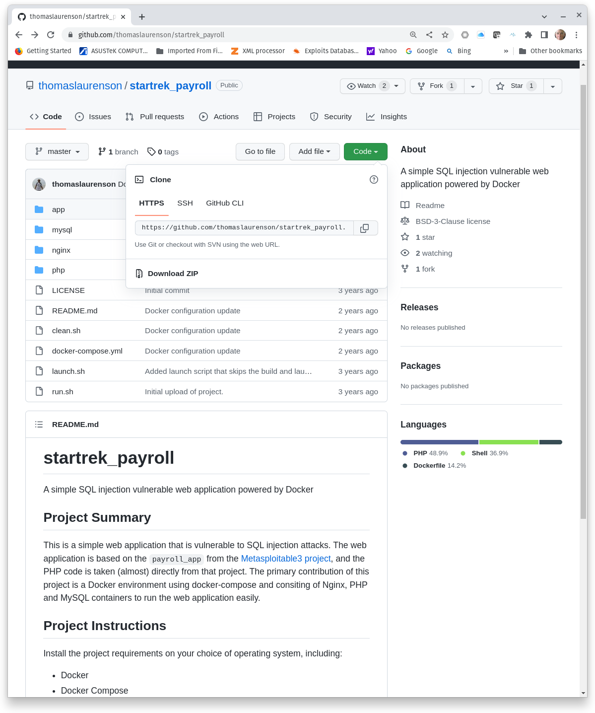

#  Introduction to Structured Query Language (SQL) for SQL injection (SQLi)

## Deploy a SQLi Lab

### Challenge 1: Clone a GitHub Repository
GitHub is a cloud-based service for developers to store and manage code, track changes, and to share code. Exercise and lab instructions for this course are shared through GitHub. This exercise uses code from another GitHub repository to deploy a Docker-based SQLi testing envrironment. The first step to build the testing environment is to **clone** the repository. Cloning simply means to copy a GitHub repository to another machine.

Figure 1 shows the [GitHub thomaslaurenson/startrek_payroll repository] used in this exercise(https://github.com/thomaslaurenson/startrek_payroll). Clicking the green Code button shows the URL used to clone the repository.



**Figure 1, GitHub Repository**

The following commands install the prerequisite **git** package, clones the repository, and shows the content of the repository on a Linux host.
```
sudo apt update && sudo apt install git -y
git clone https://github.com/thomaslaurenson/startrek_payroll.git
cd startrek_payroll
```
**Clone the thomaslaurenson/startrek_payroll repository and capture a screenshot of the contents of the repository.**

### Challenge 2: All that Stuff in this Repo!
GitHub content is normally safe, but GitHub repositories could also be used to distribute malicious or harmful content. It is a good practice to examine content in a repository you do not own or control before running scripts or deploying applications, so let's look at what is in the repository.

```
~/startrek_payroll$ ls -l
total 40
-rw-rw-r-- 1 kbarton kbarton 1524 Oct 24 15:21 LICENSE
-rw-rw-r-- 1 kbarton kbarton  911 Oct 24 15:21 README.md
drwxrwxr-x 2 kbarton kbarton 4096 Oct 24 15:21 app
-rwxrwxr-x 1 kbarton kbarton 1119 Oct 24 15:21 clean.sh
-rw-rw-r-- 1 kbarton kbarton 2051 Oct 24 15:23 docker-compose.yml
-rwxrwxr-x 1 kbarton kbarton  987 Oct 24 15:21 launch.sh
drwxrwxr-x 2 kbarton kbarton 4096 Oct 24 15:21 mysql
drwxrwxr-x 2 kbarton kbarton 4096 Oct 24 15:21 nginx
drwxrwxr-x 2 kbarton kbarton 4096 Oct 24 15:21 php
-rwxrwxr-x 1 kbarton kbarton  984 Oct 24 15:21 run.sh
```
The repository contains a license, README, three bash scripts (clean.sh, launch.sh, and run.sh), a docker-compose.yml, and four directories (app, mysql, nginx, and php).
