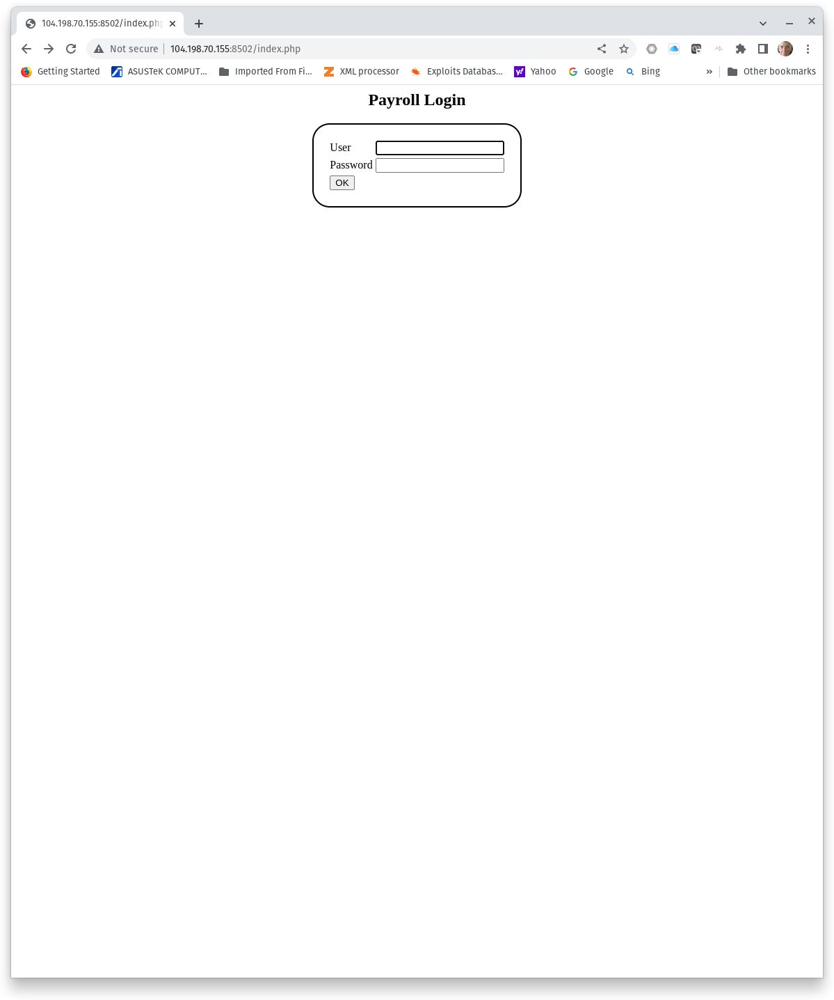
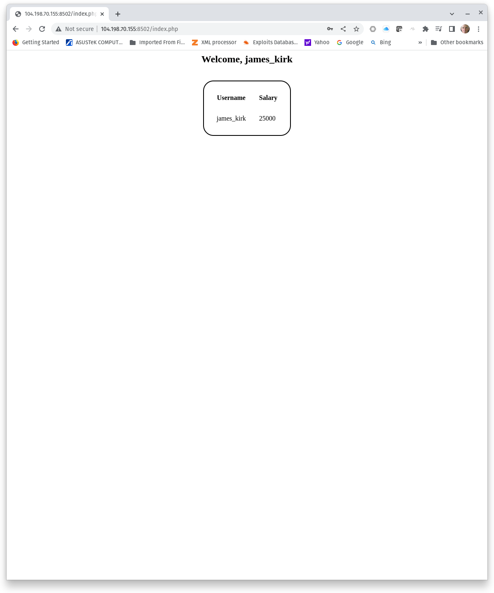

#  Introduction to Structured Query Language (SQL) for SQL injection (SQLi)

## Deploy a SQLi Lab

### Challenge 1: Clone a GitHub Repository
GitHub is a cloud-based service for developers to store and manage code, track changes, and to share code. Exercise and lab instructions for this course are shared through GitHub. This exercise uses code from another GitHub repository to deploy a Docker-based SQLi testing envrironment. The first step to build the testing environment is to **clone** the repository. Cloning simply means to copy a GitHub repository to another machine.

Figure 1 shows the [GitHub thomaslaurenson/startrek_payroll repository](https://github.com/thomaslaurenson/startrek_payroll) used in this exercise. Clicking the green Code button shows the URL used to clone the repository.


**Figure 1, GitHub Repository**

The following commands install the prerequisite **git** package, clones the repository, and shows the content of the repository on a Linux host.
```
sudo apt update && sudo apt install git -y
git clone https://github.com/thomaslaurenson/startrek_payroll.git
cd startrek_payroll
```
**Clone the thomaslaurenson/startrek_payroll repository and capture a screenshot of the contents of the repository.**

### Challenge 2: All that Stuff in this Repo!
GitHub content is normally safe, but GitHub repositories could also be used to distribute malicious or harmful content. It is a good practice to examine content in a repository you do not own or control before running scripts or deploying applications, so let's look at what is in the repository.

```
~/startrek_payroll$ ls -l
total 40
-rw-rw-r-- 1 kbarton kbarton 1524 Oct 24 15:21 LICENSE
-rw-rw-r-- 1 kbarton kbarton  911 Oct 24 15:21 README.md
drwxrwxr-x 2 kbarton kbarton 4096 Oct 24 15:21 app
-rwxrwxr-x 1 kbarton kbarton 1119 Oct 24 15:21 clean.sh
-rw-rw-r-- 1 kbarton kbarton 2051 Oct 24 15:23 docker-compose.yml
-rwxrwxr-x 1 kbarton kbarton  987 Oct 24 15:21 launch.sh
drwxrwxr-x 2 kbarton kbarton 4096 Oct 24 15:21 mysql
drwxrwxr-x 2 kbarton kbarton 4096 Oct 24 15:21 nginx
drwxrwxr-x 2 kbarton kbarton 4096 Oct 24 15:21 php
-rwxrwxr-x 1 kbarton kbarton  984 Oct 24 15:21 run.sh
```
The repository contains a license, README, three bash scripts (clean.sh, launch.sh, and run.sh), a docker-compose.yml, and four directories (app, mysql, nginx, and php).

**LICENSE** is a standard open source BSD license. The contents are simple text and authorize the use or modification of the repository content without restrictions.  

**README.md** summarizes the project and provides instructions to use the project. Note that README.md states the vulnerable web application will be found on TCP 8080. We will modify docker-compose.yml to deploy the application on another port.

The first two bash scripts **launch.sh** and **run.sh** are similar. Both scripts contain a statement that the content can be used and modified under the terms of the GNU General Public License (GNU GPL). 

The script run.sh has one command, **docker-compose up --build**. The script launch.sh has a similar command, **docker-compose up**. The first script is used to build the images while the second script is used to start the containers. In practice, launch.sh would build the images and start the containers without having to run the command in run.sh. We will not use either of these scripts. Instead, we will deploy the containers by running **sudo docker-compose up -d**.

The last script, clean.sh stops the containers, removes associated volumes and containers, and removes the images.

The three scripts are safe, so examine **docker-compose.yml**. Again, we find a statement that the content is licensed for use and modification under GNU GPL. In addition, there is a complete docker-compose configuration. Let's examine this.

```
version: '3'
services:
  mysql:
    image: mysql:5.5
    container_name: startrek_payroll_mysql
    restart: unless-stopped
    environment:
      - MYSQL_HOST=localhost
      - MYSQL_ROOT_PASSWORD=sploitme
      - MYSQL_DATABASE=payroll
      - MYSQL_PORT=3306
    volumes:
      - ./mysql/startrek_payroll.sql:/docker-entrypoint-initdb.d/startrek_payroll.sql
    networks:
      - backend

  php:
    image: php:8.0-fpm
    container_name: startrek_payroll_php
    restart: unless-stopped
    build:
      context: php
      dockerfile: Dockerfile
    depends_on:
      - mysql
    volumes:
      - ./app:/app
    networks:
      - backend

  nginx:
    image: nginx:stable-alpine
    container_name: startrek_payroll_nginx
    restart: unless-stopped
    depends_on:
      - mysql
      - php
    ports:
      - "8080:80"
    volumes:
      - ./app:/app
      - ./nginx/site.conf:/etc/nginx/conf.d/default.conf
    networks:
      - frontend
      - backend

networks:
  frontend:
    driver: bridge
  backend:
    driver: bridge
```
The project will deploy three separate containers: a MySQL database service, nginx web server, and a PHP service.The nginx service is dependent on both the mysql and php services. Names for all three containers are specified in the .yml file, and could be modified if you desired. 

Each container is also bound to a local volume. Assigning a volume makes the container's data more persistent and easier to backup. Assigning a volume connects a container's internal directory to an external directory on the host. In this project, internal directories are being connected to directories in the repository: app, mysql, and nginx. The content of app, mysql and nginx will be the deployed application. 

Two network are created. The network names are **frontend** and **backend**. The services mysql and php are connected to backend and nginx is connected to both backend and frontend.

Environment variables are set for mysql, to include the root user's password and the database name payroll. The database payroll will be populated with the content from /mysql/startreck_payroll.sql. 

Directory php/ contains a Dockerfile. Dockerfile is used to build the php service in docker-compose.yml.

Before we deploy the lab, **modify docker-compose.yml to change the published port on nginx from 8080 to 8502**. Save the modified docker-compose.yml and start the project with the command:

```
~/startrek_payroll$ sudo docker-compose up -d

Status: Downloaded newer image for nginx:stable-alpine
Creating startrek_payroll_mysql ... done
Creating startrek_payroll_php   ... done
Recreating startrek_payroll_nginx ... done
```

Verify the project is running by browsing to the application. See Figure 2.



**Figure 2, Payroll Login**

**Capture a screenshot of the Payroll Login page.**

## SQL Query
### Challenge 3: Getting a SQL Shell

We will start by running some basic SQL queries inside our database server using a **SQL shell**. A SQL shell looks very similar to a Bash shell but is used to run SQL queries rather the Bash commands. We need to know the MySQL root user's password to authenticate to MySQL. Recall that the password was set in docker-compose.yml. It is also disclosed in app/index.php. 

**Login as the MySQL root user. Find the password and use it to authenticate when prompted for a password.**

The option -u root logs in as the MySQL root user. The option -p will prompt for a password during authentication.

```
~/startrek_payroll$ sudo docker exec -it startrek_payroll_mysql bash

root@afc147c30e7c:/# mysql -u root -p
Enter password: 

Welcome to the MySQL monitor.  Commands end with ; or \g.
Your MySQL connection id is 69
Server version: 5.5.62 MySQL Community Server (GPL)

Copyright (c) 2000, 2018, Oracle and/or its affiliates. All rights reserved.

Oracle is a registered trademark of Oracle Corporation and/or its
affiliates. Other names may be trademarks of their respective
owners.

Type 'help;' or '\h' for help. Type '\c' to clear the current input statement.

mysql> 
```
**Capture a screenshot of the SQL shell.**

### Challenge 4: Enumerating the Database Management System (DBMS)
The exact syntax and database schema tables needed to execute a successful SQLi attack are dependant on the underlying DBMS. Therefore, enumerating the DMBS is a useful place to start learning SQL queries. Start by discovering the DBMS version and current user. Since we are building toward a SQLi attack, we will start by enumerating these details using SQL queries. Note, all SQL queries (ok, with a couple of exceptions) must end with a semi-colon. The command SELECT can be either uppercase or lowercase.

SELECT version() reports the version.
SELECT user() reports the current user.
SELECT database()

```
mysql> SELECT version();
+-----------+
| version() |
+-----------+
| 5.5.62    |
+-----------+
1 row in set (0.00 sec)

mysql> SELECT user();
+----------------+
| user()         |
+----------------+
| root@localhost |
+----------------+
1 row in set (0.00 sec)

mysql> select db();
ERROR 1305 (42000): FUNCTION db does not exist
mysql> SELECT database();
+------------+
| database() |
+------------+
| NULL       |
+------------+
1 row in set (0.00 sec)

```

SQL SHOW commands will show available databases, tables, columns and other metadata. Use SHOW commands to enumerate mysql users. 

```
mysql> SHOW databases;
+--------------------+
| Database           |
+--------------------+
| information_schema |
| mysql              |
| payroll            |
| performance_schema |
+--------------------+
4 rows in set (0.00 sec)

mysql> SHOW tables IN mysql;
+---------------------------+
| Tables_in_mysql           |
+---------------------------+
| columns_priv              |
| db                        |
| event                     |
| func                      |
| general_log               |
| help_category             |
| help_keyword              |
| help_relation             |
| help_topic                |
| host                      |
| ndb_binlog_index          |
| plugin                    |
| proc                      |
| procs_priv                |
| proxies_priv              |
| servers                   |
| slow_log                  |
| tables_priv               |
| time_zone                 |
| time_zone_leap_second     |
| time_zone_name            |
| time_zone_transition      |
| time_zone_transition_type |
| user                      |
+---------------------------+
24 rows in set (0.01 sec)

mysql> SHOW columns IN mysql.user;
+------------------------+-----------------------------------+------+-----+---------+-------+
| Field                  | Type                              | Null | Key | Default | Extra |
+------------------------+-----------------------------------+------+-----+---------+-------+
| Host                   | char(60)                          | NO   | PRI |         |       |
| User                   | char(16)                          | NO   | PRI |         |       |
| Password               | char(41)                          | NO   |     |         |       |
| Select_priv            | enum('N','Y')                     | NO   |     | N       |       |
| Insert_priv            | enum('N','Y')                     | NO   |     | N       |       |
| Update_priv            | enum('N','Y')                     | NO   |     | N       |       |
| Delete_priv            | enum('N','Y')                     | NO   |     | N       |       |
| Create_priv            | enum('N','Y')                     | NO   |     | N       |       |
| Drop_priv              | enum('N','Y')                     | NO   |     | N       |       |
| Reload_priv            | enum('N','Y')                     | NO   |     | N       |       |
| Shutdown_priv          | enum('N','Y')                     | NO   |     | N       |       |
| Process_priv           | enum('N','Y')                     | NO   |     | N       |       |
| File_priv              | enum('N','Y')                     | NO   |     | N       |       |
| Grant_priv             | enum('N','Y')                     | NO   |     | N       |       |
| References_priv        | enum('N','Y')                     | NO   |     | N       |       |
| Index_priv             | enum('N','Y')                     | NO   |     | N       |       |
| Alter_priv             | enum('N','Y')                     | NO   |     | N       |       |
| Show_db_priv           | enum('N','Y')                     | NO   |     | N       |       |
| Super_priv             | enum('N','Y')                     | NO   |     | N       |       |
| Create_tmp_table_priv  | enum('N','Y')                     | NO   |     | N       |       |
| Lock_tables_priv       | enum('N','Y')                     | NO   |     | N       |       |
| Execute_priv           | enum('N','Y')                     | NO   |     | N       |       |
| Repl_slave_priv        | enum('N','Y')                     | NO   |     | N       |       |
| Repl_client_priv       | enum('N','Y')                     | NO   |     | N       |       |
| Create_view_priv       | enum('N','Y')                     | NO   |     | N       |       |
| Show_view_priv         | enum('N','Y')                     | NO   |     | N       |       |
| Create_routine_priv    | enum('N','Y')                     | NO   |     | N       |       |
| Alter_routine_priv     | enum('N','Y')                     | NO   |     | N       |       |
| Create_user_priv       | enum('N','Y')                     | NO   |     | N       |       |
| Event_priv             | enum('N','Y')                     | NO   |     | N       |       |
| Trigger_priv           | enum('N','Y')                     | NO   |     | N       |       |
| Create_tablespace_priv | enum('N','Y')                     | NO   |     | N       |       |
| ssl_type               | enum('','ANY','X509','SPECIFIED') | NO   |     |         |       |
| ssl_cipher             | blob                              | NO   |     | NULL    |       |
| x509_issuer            | blob                              | NO   |     | NULL    |       |
| x509_subject           | blob                              | NO   |     | NULL    |       |
| max_questions          | int(11) unsigned                  | NO   |     | 0       |       |
| max_updates            | int(11) unsigned                  | NO   |     | 0       |       |
| max_connections        | int(11) unsigned                  | NO   |     | 0       |       |
| max_user_connections   | int(11) unsigned                  | NO   |     | 0       |       |
| plugin                 | char(64)                          | YES  |     |         |       |
| authentication_string  | text                              | YES  |     | NULL    |       |
+------------------------+-----------------------------------+------+-----+---------+-------+
42 rows in set (0.00 sec)
```
**Capture a screenshot of the columns in table mysql.user. **

### Challenge 5: SELECT statement

The SELECT statement is used to query content from one or more tables. We enumerated the columns in the mysql.user table, so now let's see if we can extract user information from that table. We are interested in three _fields_ (columns) in mysql.user: user, host, and password. 

Use a SELECT statement to get all users. The syntax for a SELECT statement is:

```
SELECT column1,column2,column3 FROM table

or

SELECT column1,column2,column3 FROM database.table
```
An example from our MySQL server:

```
mysql> SELECT user,host,password FROM mysql.user;
+------+-----------+-------------------------------------------+
| user | host      | password                                  |
+------+-----------+-------------------------------------------+
| root | localhost | *67A5195F64E08F5700B665061545D5473D77B5D7 |
| root | %         | *67A5195F64E08F5700B665061545D5473D77B5D7 |
+------+-----------+-------------------------------------------+
2 rows in set (0.00 sec)
```
Note in the example above, we are running a SQL query against a table in a specific database. We can do so because our current MySQL user is root. In most cases, your user will not be root when executing SQLi injection attacks and will not have permissions to read databases other than the current database. The following shows:
1. Listing all databases.
2. Selecting the **payroll** database.
3. Listing all tables in the **payroll** database. The only table found was **users**.
4. Listing all columns in the **users** table.

```
mysql> SHOW databases;
+--------------------+
| Database           |
+--------------------+
| information_schema |
| mysql              |
| payroll            |
| performance_schema |
+--------------------+
4 rows in set (0.00 sec)

mysql> use payroll
Reading table information for completion of table and column names
You can turn off this feature to get a quicker startup with -A

Database changed
mysql> SHOW tables;
+-------------------+
| Tables_in_payroll |
+-------------------+
| users             |
+-------------------+
1 row in set (0.00 sec)

mysql> SHOW columns IN users;
+------------+-------------+------+-----+---------+-------+
| Field      | Type        | Null | Key | Default | Extra |
+------------+-------------+------+-----+---------+-------+
| username   | varchar(30) | NO   |     | NULL    |       |
| first_name | varchar(30) | NO   |     | NULL    |       |
| last_name  | varchar(30) | NO   |     | NULL    |       |
| password   | varchar(40) | NO   |     | NULL    |       |
| salary     | int(20)     | NO   |     | NULL    |       |
+------------+-------------+------+-----+---------+-------+
5 rows in set (0.00 sec)
```
Finally, we can discover **username** and **password** for every user in the payroll database.

```
mysql> SELECT username,password FROM users;
+------------------+------------------+
| username         | password         |
+------------------+------------------+
| james_kirk       | kobayashi_maru   |
| mr_spock         | 0nlyL0g!c        |
| leonard_mccoy    | hesDEADjim!      |
| nyota_uhura      | StarShine        |
| montgomery_scott | ScottyDoesntKnow |
| hiraku_sulu      | parking-break-on |
| pavel_chekov     | 99victorvictor2  |
+------------------+------------------+
7 rows in set (0.01 sec)
```

Let's take a set of credentials for a spin and see if we can login with the stolen credentials. For example, we can login as james_kirk (Figure 3):



**Figure 3, Payroll Login with Stolen Credentials**

**Capture a screenshot of a successful login using stolen credentials.**

### Challenge 6: Examine web application source code
Next, we will walk through the web application to see where we might find SQLi vulnerabilities, starting with the HTTP POST form. The following section of source code creates the POST request when a user attempts to login. Two lines are important for our analysis (HTML tags are removed):

input type="text" name="**user**"
input type="password" name="**password**"

The above lines define the parameters **user** and **password** in the POST request.
```
<?php
if (!isset($_POST['s'])) {
?>
    <center>
        <form action="" method="post">
            <h2>Payroll Login</h2>
            <table style="border-radius: 25px; border: 2px solid black; padding: 20px;">
                <tr>
                    <td>User</td>
                    <td><input type="text" name="user"></td>
                </tr>
                <tr>
                    <td>Password</td>
                    <td><input type="password" name="password"></td>
                </tr>
                <tr>
                    <td><input type="submit" value="OK" name="s">
                </tr>
            </table>
        </form>
    </center>
<?php
```

Parameters **user** and **password** from the form are used to create variables used in the SQL query. See below:

```
$user = $_POST['user'];

$pass = $_POST['password'];
```

Next, the variables **$user** and **$pass** are used to create a SQL query. The query itself is variable $sql, while the IF function uses the $conn and $sql variables to run the query. We are primarily interested in the $sql variable because that is where we find the vulnerability. 

```
$sql = "select username, salary from users where username = '$user' and password = '$pass'";

if ($conn->multi_query($sql))
```

Note that user input from the form is passed directly to $sql without sanitization. Everything a user enters in either the user or password fields in the POST form will be passed directly to the SQL statement. So, let's look at how this affects the SQL queries. 

Assume a user enters the credentials **james_kirk** and **kobayashi_maru** for $user and $pass. The query and results are shown below:

```
mysql> select username, salary from users where username = 'james_kirk' and password = 'kobayashi_maru';
+------------+--------+
| username   | salary |
+------------+--------+
| james_kirk |  25000 |
+------------+--------+
1 row in set (0.00 sec)
```
Ok, but what if an attacker entered something unexpected in the $user variable? Could an attacker escape the SQL query written in the source code and craft their own query?

Note that text strings are wrapped with single quotation marks. For example **'james_kirk'** and **'kobayashi_maru'**. A single quotation mark entered in place of a valid username would create a SQL statement such as:

select username, salary from users where username = **'''** and password = **'kobayashi_maru'**;

The odd number of quotation marks creates a syntax error and would force a SQL error. Let's see if we can extend the attack to create a valid SQL query. First, we need to understand what an OR statement would do. The following query include an always true OR clause. Every row of the table users would be evaluated against the OR clause 1=1, and since 1=1 would be true, every row of the table would be returned. Give it a try.

```
mysql> select username, salary from users where username = 'james_kirk' OR 1=1;
+------------------+--------+
| username         | salary |
+------------------+--------+
| james_kirk       |  25000 |
| mr_spock         |  99000 |
| leonard_mccoy    |  45000 |
| nyota_uhura      |  39000 |
| montgomery_scott |   1250 |
| hiraku_sulu      |   3500 |
| pavel_chekov     |   2500 |
+------------------+--------+
7 rows in set (0.00 sec)
```
Now, we make a slight modification to the SQL query by adding the rest of coded query, but we comment out the newly added part using **;#** or **;-- **. 

**select username, salary from users where username = 'james_kirk' OR 1=1;#' and password = 'kobayashi_maru';**
or
**select username, salary from users where username = 'james_kirk' OR 1=1;-- ' and password = **'kobayashi_maru'**;**

