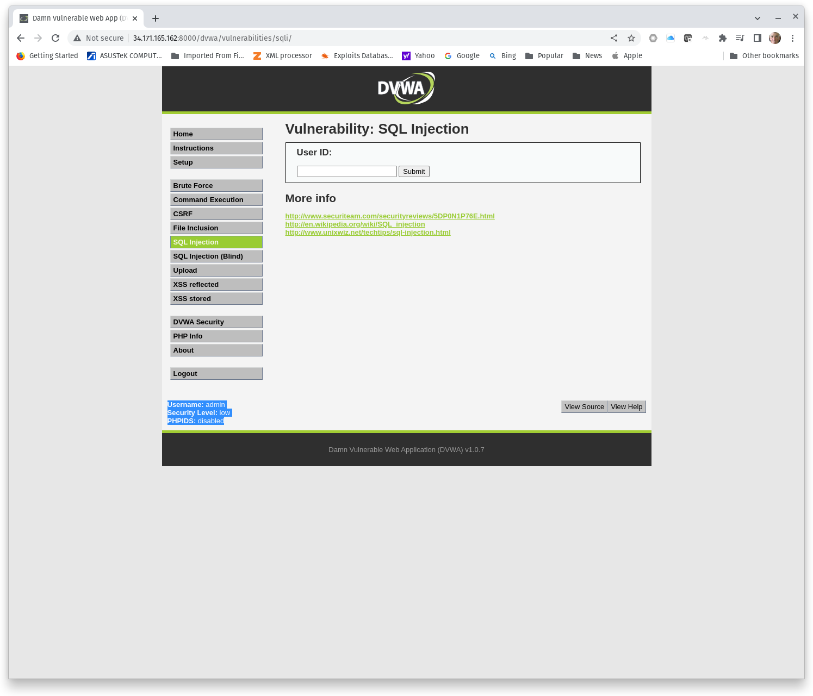

#  Introduction to SQL injection (SQLi)

## Deploy a SQLi Lab

### Challenge 1: DVWA
1. Start a Metasploitable2 Docker container and browse to DVWA. 
2. Login with the default credentials **admin**/**password**.
3. Set **DVWA Security** to **Low**.
4. Select **SQL Injection**.

Figure 1 illustrates DVWA security set to low.

**Figure 1, DVWA**
