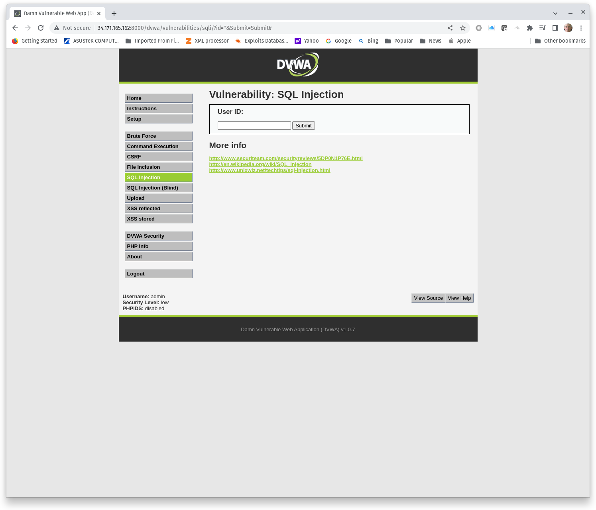
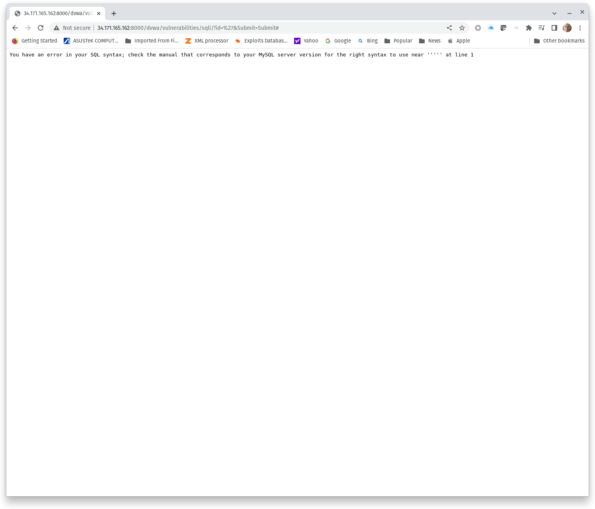
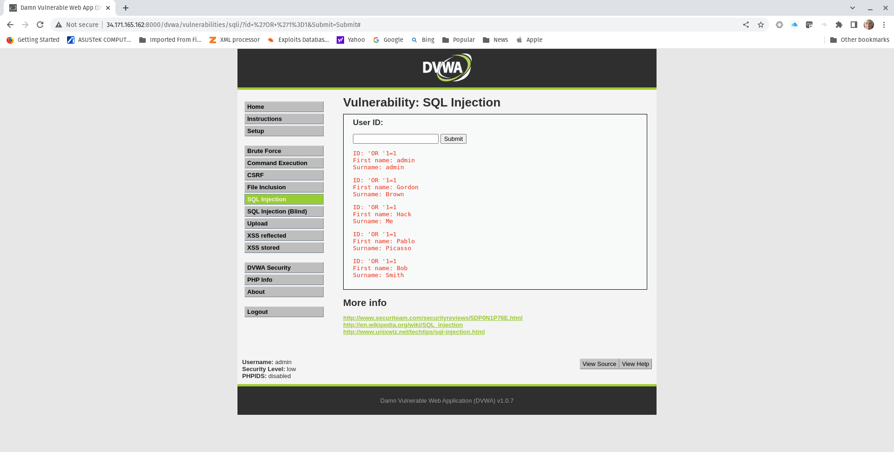

#  Introduction to SQL injection (SQLi)

## Deploy a SQLi Lab

### Challenge 1: DVWA
1. Start a Metasploitable2 Docker container and browse to DVWA. 
2. Login with the default credentials **admin**/**password**.
3. Set **DVWA Security** to **Low**.
4. Select **SQL Injection**.

Figure 1 illustrates DVWA security set to low.


**Figure 1, DVWA**

## Discover SQLi Vulnerability

### Challenge 2: Finding the SQL Injection Point

The SQL Injection point is the HTTP header, GET/POST request parameter, or other user input field where an attacker can escape a structured SQL statement and create their own SQL statement. If an attacker is lucky, a SQL injection point can be discovered by creating a syntax error that forces a SQL error. Receiving a SQL error from is a strong indicator of a SQLi vulnerability. Therefore, a best practice for web developers is to suppress SQL errors. Suppressing SQL errors does not by itself defend against SQLi attacks, but it does increase the work required to successfully execute a SQLi attack.

DVWA does not suppress SQL errors in the Low security setting. Therefore, we can demonstrate the existence of a SQLi vulnerability by forcing a SQL error. Note that user input entered in the form is reflected in the URL, as shown in Figure 2. The URL could be modified to test for SQLi vulnerability.



**Figure 2, User Input in the URL**

Figure 3 shows a SQL error returned to the web application. A single-quotation mark was passed in the _id_ parameter and returned a SQL error. This indicates that a single-quotation mark can be used to escape the scripted SQL statement and that likely an attacker could craft their own SQL statement. This is the _SQL Injection point_.



**Figure 3, SQL Error Indicating SQL Injection Point**

### Challenge 3: Injecting a Malicious SQL Statement
Once a tester discovers a SQL injection point, the next step is demonstrating the ability inject a malicious SQL statement. Common strings include TRUE condition SQL OR statements appended to the escape character (i.e, " or '). Some applications may prohibit spaces, text strings such as OR, or use other controls to reduce exposure to SQLi attacks. Following or different iterations of the same TRUE condition OR statement: **OR 1=1**.

```
or 1=1
or '1=1
or '1'='1
or '1'='1'
or 1=1#
or '1=1'#
or '1'='1'#
or 1=1;#
or '1=1';#
or '1'='1';#
||1=1
||'1=1
||'1'='1
||'1'='1'
||1=1#
||'1=1'#
||'1'='1'#
||1=1;#
||'1=1';#
||'1'='1';#
or/**/1=1
or/**/'1=1
or/**/'1'='1
or/**/'1'='1'
or/**/1=1#
or/**/'1=1'#
or/**/'1'='1'#
or/**/1=1;#
or/**/'1=1';#
or/**/'1'='1';#
```
DVWA is vulnerable to a simple OR statement and will disclose all users. Figure 4 shows a succcessful SQLi attack using the string **'OR '1=1**.



**Figure 4, SQLi Proof**


**Capture a screenshot showing a successful SQLi attack against DVWA that discloses application users using a string other than "'OR '1=1".**

## SQLi: Enumerate the DBMS and Database
### Challenge 4: Discover the number of fields in a response using an ORDER BY statement

Fully enumerating a DBMS and database through SQLi will require a UNION statement. However, for a UNION statement to work our queries must use exactly the same number of _fields_, or columns, as the SQL statement scripted in the web application. An ORDER BY statement sorts the response from a SQL query by a specified field. Consider the following SQL query.
```
SELECT user,host,password FROM mysql.user ORDER BY 1;
```
You might recognize the query as listing MySQL users in a MySQL DBMS. However, the query goes a step further and sorts the response in order of the first field. In this case, the first field is 'user'. The following queries sort the responses by the second and third fields, 'host' and 'password', respectively.

```
SELECT user,host,password FROM mysql.user ORDER BY 2;
SELECT user,host,password FROM mysql.user ORDER BY 3;
```

That's all well and good, but alone does not give use the information needed for a UNION SELECT statement in a SQLi attack. We need to know not only how many fields are in the SQL query response (i.e., at least 3 in this case), but also how many fields are not in the response (i.e., less than 4). This example has three fields. An attempt to sort the response by field 4 would create a SQL error. **A successful query to ORDER BY 3 and a failed query to ORDER BY 4 proves that the SQL query has 3 fields in the response. Therefore, our UNION SELECT statement must have three fields in the response**.

The following SQLi string will order the DVWA response by field 1, which appears to be the first name.

```
'or 1=1 order by 2 #
```

**Enumerate the number of fields in the DVWA SQL query and capture a screenshot showing the first SQL error from ORDER BY statements.**

### Challenge 5: Enumerate the DBMS
The following SQLi string will show the DBMS version.
```
'union select 1,@@version #
```
Modify the above query to enumerate the current user and database.

|Function|SELECT Statement|
|---|---|
|Show current user|SELECT user()|
|Show current database|SELECT database()|

**Capture a screenshot of the current database.**

### Challenge 6: Enumerate tables and columns
In a SQL shell, we would enumerate tables and columns using the **SHOW tables** and **SHOW columns in _table_** queries. However, we normally do not have the luxury of a SHOW statement in a SQLi attack, but we still need to enumerate tables and columns to fully exploit a database in a SQLi attack. Database details can be collected from the information schema database using SELECT statements. A [SQLi cheat sheet](https://pentestmonkey.net/cheat-sheet/sql-injection/mysql-sql-injection-cheat-sheet) can come in handy when attempting to enumerate database schema information.
