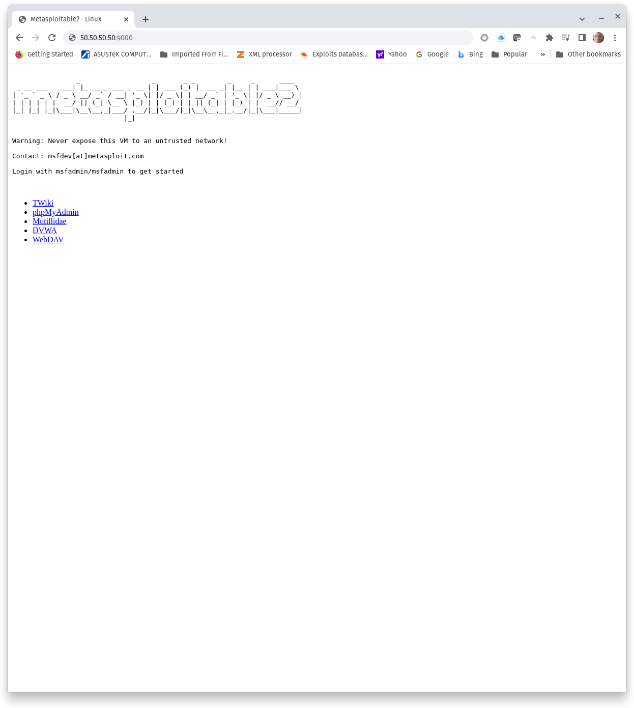

#  Web Application Enumeration

## Web application resources
[Mozilla](https://developer.mozilla.org/en-US/docs/Web/HTTP/Basics_of_HTTP/Identifying_resources_on_the_Web) defines a _resource_ as a directory or file (document, photo or anything else) that is the target of an HTTP request. An HTTP request to a resource that does not exist will result in a HTTP 404 Not Found response code. A request to any resource that exists will result in some other HTTP response code. Examples of common response codes for resources that exist include:

|HTTP Response Code|Description|
|:-:|---|
|200|OK. The request succeeded.|
|301|Redirect. Resource permanently moved.|
|401|Unauthenticated. Client must authenticate to access resource|
|403|Forbidden. Client's identity is known but client not authorized to access the resource.|
|500|Internal server error. A general error that just means something didn't work or wasn't allowed.|

<sub>**Table 1, HTTP Response Codes**</sub>

In general, a 404 response code means a requrested resource does not exist. Any other response code can generally indicate that a requested resource does exist. This pattern of behavior can be used to identify resources through [forced browsing](https://owasp.org/www-community/attacks/Forced_browsing#:~:text=Forced%20browsing%20is%20an%20attack,application%2C%20but%20are%20still%20accessible.) Attackers or web application testers use forced browsing to enumerate and access resources that are not referenced by an application, or to identify applications that may not be intended for public access.

## Web application organization on a web server
Before we look at the tools used to enumerate web application resources, let's first discuss how web applications and their resources are separated and organized on a web server. A **web server** is the application used to serve resources to clients. You installed Apache2 in previous assignments. Apache2 is a very popular web service. Other web servers include Nginx, IIS, Lighttpd, and Apache Tomcat. Even Python can be used to create a simple HTTP server. 

An important detail to understand is that a single web server can simultaneously serve multiple web applications or websites. A web application or website is fundamentally a group of _resources_ that operate together to create a single application or site. A single application or website consists of application's/site's root directory, subdirectories, and files stored in those directories. Multiple applications or sites can be served on the same web server by storing the application/site root directories in the webroot or some subdirectory of the webroot. Table 2 illustrates how three web applications could be served on a single web server.

|Description|Application/Site <br />webroot = /var/www/html|Application Subdirectory|Resource|
|---|---|---|---|
|WordPress blog|webroot/|.|index.php|
|WordPress blog|webroot/wp-admin/|index.php|
|WordPress blog|webroot/wp-content/|index.php|
|WordPress blog|webroot/wp-includes/|admin-bar.php|
|phpMyAdmin application|webroot/phpmyadmin/|index.php|
|phpMyAdmin application|webroot/phpmyadmin/docs/|index.rst|
|phpMyAdmin application|webroot/phpmyadmin/js/|global.d.ts|
|phpMyAdmin application|webroot/phpmyadmin/sql/|create_tables.sql|
|October CMS|webroot/october/|index.php|
|October CMS|webroot/october/app/|Provider.php|
|October CMS|webroot/october/config/|backend.php|
|October CMS|webroot/october/tests/|bootstrap.php|

<sub>**Table 2, Web Application Segmentation**</sub>

Table 2 partially illustrates the installation of three web applications on a single web server. WordPress is installed in the webroot, phpMyAdmin is in the subdirectory phpmyadmin/, and October CMS is in the subdirectory october/. Table 3 shows the URLs that would be used to browse to each application.

|Application|URL|
|---|---|
|WordPress blog|http://localhost/|
|phpMyAdmin|http://localhost/phpmyadmin/|
|October CMS|http://localhost/october/|

<sub>**Table 3, Sample Web Application URLs**</sub>

So, why is this important? Let's assume in this example that the WordPress site is intended for public access and public use. Perhaps a DNS record points to the WordPress site and it is regularly visited by public users, but the October CMS and phpMyAdmin sites are not intended for public use. The system administrator has not provided any DNS records to point to those applications and no URLs are provided on the server to point a user to either application. It might seem that the phpMyAdmin and October CMS applications are _hidden_ from the public. That might be true, as long as no user discovered the subdirectories phpmyadmin/ or october/. 

The following section discusses the ways an attacker or web application tester could discover these _hidden_ resources.

## Web resource enumeration

There are three basic methods to discover _hidden_ web resources.
1. Website scraping
2. Robots.txt
3. Forced browsing

### Website scraping
Web scraping is an automated method to search for and extract specific data types from a website. A bot can crawl a website searching for links that may point to _hidden_ resources on a web server. These links may be found on rendered pages of the site, comments embedded within pages, or by examining redirects from the website or javascript embedded within the site.

**OWASP Zap** is a powerful example of this type of tool.

### Robots.txt
A robots.txt file is used to manage web crawler (i.e., search engine crawlers) on a website. Robots.txt informs web crawlers what resources should be crawled and what resources should be exclude from crawling activity. Below is a sample robots.txt file:
```
User-agent: Googlebot
Disallow: /october/
Disallow: /phpmyadmin/

User-agent: *
Allow: /

Sitemap: http://www.example.com/sitemap.xml
```

The above example would direct Googlebot to avoid crawling resources in October CMS and phpMyAdmin applications, but allow all bots to crawl the WordPress application. This is great ... for well-behaved bots. However, it also discloses the existence of web resources in the directories october/ and phpmyadmin/. To discover this information, a web application tester or attacker would simply have to browse to robots.txt. Robots.txt files could exist in multiple directories, but the most common place to find robots.txt is the webroot. Therefore, a user could check for the existance and content of robots.txt simply by browsing to the resource. For example, http://localhost/robots.txt would disclose the contents of robots.txt in our example. As a minimum, each individual web application or website should be inspected for a robots.txt file.

### Forced browsing
Recall from Table 3 that we could find the three web applications simply by browsing to URLs that hold those applications, even scraping the web server or checking for robots.txt did not reveal the _hidden_ resources. **Forced browsing uses a brute force attack to test for resources that are not otherwise disclosed.** A tool, such as dirb, gobuster, dirbuster or wfuzz crafts and sends HTTP requests using a _wordlist_. The wordlist would include possible resource names, such as files or directories. An automated tool sends HTTP requests testing for the existence of resources on a web server. For example, 404 response codes suggests a resource does not exist. Response codes such as 200, 301, and 403 indicate that a resource exists, or likely exists.

In this case, an automated tools might see 404 response codes dev/ or uploads/ on our web server, but 200 or 403 response codes for october/ and phpmyadmin/. 

**A note about _wordlists_ and forced browsing.** Forced browsing can only discover a resource if there is a word in the wordlist that matches the resource. Therefore, you must understand the limitations of your wordlist and perhaps use larger or multiple wordlists when running forced browsing attacks. There are times when a custom wordlist may be necessary.

## Challenge 1: Prepare the lab environment
Metasploitable2 includes multiple web applications. Some are linked directly to the web server's home page. The home page itself is an index page (i.e., index.html, index.htm, index.php, etc) in the webroot. Directions to deploy a Metasploitable2 Docker container are provided in the course, but the following command would bind ports from the Metasploitable2 Docker container to the host. The command could be modified to exclude binding services that we are not testing right now. Importantly, the command binds TCP 80 (httpd) on Metasploitable 2 to TCP 9000 on the host.

```
sudo docker run -p 2222:22 -p 20:20 -p 21:21 -p 2323:23 -p 25:25 -p 514:514 -p 2049:2049 -p 3632:3632 -p 9000:80 --name metasploitable2 --hostname metasploitable2 -it -d tleemcjr/metasploitable2:latest sh -c "/bin/services.sh && bash"
```

Either a firewall rule must allow access from trusted sources or you must deploy a VPN to your network or the host running the Metasploitable2 Docker container. OpenVPN instructions are provided in the course and GCP firewall configuration was previously covered. **DO NOT EXPOSE ANY METASPLOITABLE2 SERVICES TO UNTRUSTED USERS.**

Last, a Kali or other machine with the following tools is required:
- OWASP Zap
- dirbuster
- dirb
- gobuster
- curl 
- traditional GUI-based browser

## Challenge 2: Browse to Metasploitable2
Demonstrate that you can browse to Metasploitable2. Note: we bound httpd from Metasploitable2 to TCP 9000 on the host, so we cannot browse to the default httpd port (TCP 80). The following URL will direct us to TCP 9000 on IP address 50.50.50.50. Modify the URL to browse to your Metasploitable2.
```
http://50.50.50.50:9000
```
Following is an example of the Metasploitable2 home page:


<sub><i>Figure 1. Metasploitable2 Home Page</i></sub>

**Capture a screenshot of the Metasploitable2 home page.**

## Challenge 2: Examine links and web server directories
Start by examining the five links TWiki, phpMyAdmin, Mutillidae, DVWA and WebDav. Report the URLs discovered for each link in Table 4.

|Link|___ ___ URL ___ ___ |
|---|---|
|TWiki||
|phpMyAdmin||
|Mutillidae||
|DVWA||
|WebDAV||

<sub>**Table 4, URLs to Metasploitable2 links**</sub>

**Complete Table 4 and prepare the completed table for submission.**

Next, get a shell on Metasploitable2 (i.e., using **docker exec**, **ssh**, or any other technique that gets you a shell) and examine the webroot **/var/www**. Compare the directories discovered in the webroot to those discovered by examining the links on Metasploitable2's home page. **Report your findings. Were the directories discovered through the links in the webroot? Are there directories that were not disclosed through the links?**

Finally, examine /var/www for robots.txt. Note that robots.txt does not exist in /var/www/. Therefore, we would expect that an attempt to browse to http://your-host/robots.txt would return a Not Found error. So, give it a try. 
1. Use your browser to browse to /robots.txt.
2. From the host, use **curl** to browse to /robots.txt.

```
curl localhost:9000/robots.txt
```

**Capture a screenshot of the response from the attempt to curl to /robots.txt.**

## Challenge 3: OWASP Zap

Start OWASP Zap in Kali.

**Applications** > **Web Application Analysis** > **owasp-zap**
Enter the URL to Metasploitable2 and click **Attack**.

Observe the Sites window. The links disclosed on the Metasploitable2 home page will be reported, and their subdirectories are at least partially discovered. However, note that the additional directories we saw in Metasploitable2's webroot are not discovered.

OWASP Zap will also report various alerts.

Inspect the different tabs in OWASP Zap, such as Request and Response, Alerts, Spider, etc.

## Challenge 4: Forced browsing with dirbuster, dirb, and gobuster

###
