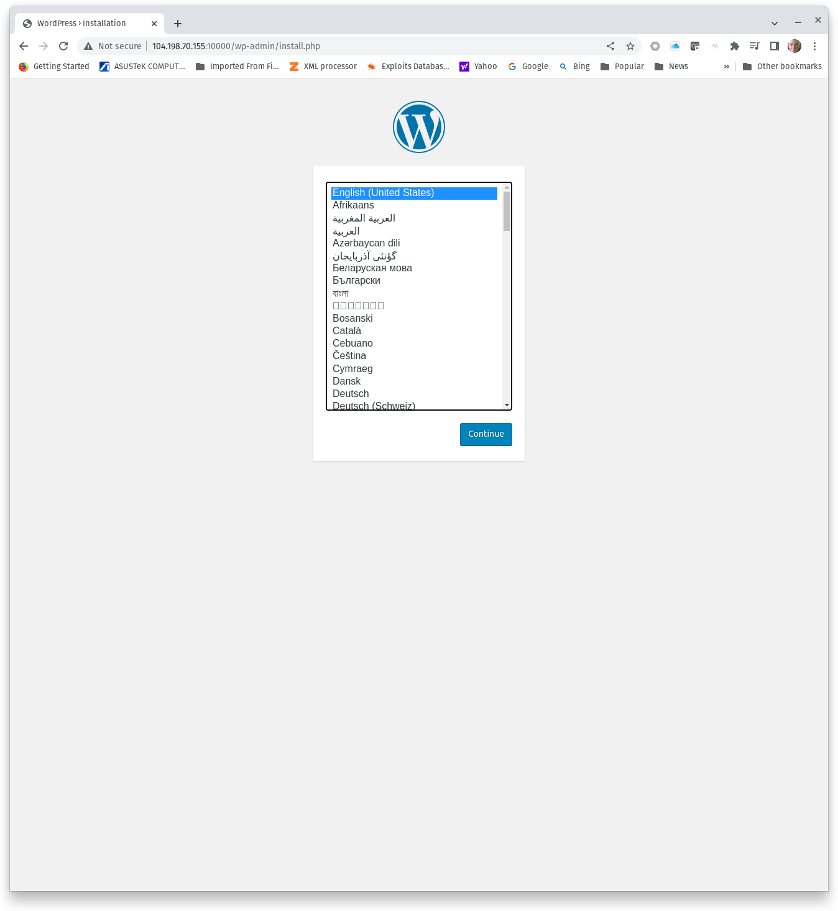

#  Web Application Enumeration - Vulnerability Scans

## Web application user enumeration and password attacks
This exercise introduces two additional tools for web application vulnerability testing: **wpscan** and **wfuzz**. 

Wpscan is a dedicated WordPress vulnerability scanner capable of detecting known vulnerabilities in the WordPress core and in WordPress plugins. Security in the ordPress core has been improved significantly over the years. Modern releases are well patched and well-known vulnerabilities have been effictively remediated. WordPress plugins are a different story. WordPress plugins are created by third-party developers. Most vulnerabilities in modern WordPress deployments are found in plugins, not the WordPress core. Wpscan tests both the core and plugins for known vulnerabilies.

Wfuzz is an http/https fuzzing tool that can be used for directory or resource enumeration and web application password attacks. This exercises focuses on web application password attacks using wfuzz.

## Building the lab

### Challenge 1: Build Wordpress
The target web applications will be build using Docker containers. The Docker containers and their networking configurations will be deployed using docker-compose. Docker-compose may not be installed on your server, so the first step is to install docker-compose.

```
sudo apt update &&  sudo apt install docker-compose -y
```

Configuration for Docker containers created with docker-compose are established in a .yml file. Although the .yml filename can be custom, the default filename for docker-compose configuration files is **docker-compose.yml**. We will use the default filename. Prepare your Ubuntu server:
1. Create a directory named **wordpress/**
2. In wordpress/ create the file **docker-compose.yml** and add the following to docker-compose.yml:

```
version: '2'
services:
 web:
   container_name: wordpress
   image: vulhub/wordpress:4.6
   depends_on:
    - mysql
   environment:
    - WORDPRESS_DB_HOST=mysql:3306
    - WORDPRESS_DB_USER=root
    - WORDPRESS_DB_PASSWORD=root
    - WORDPRESS_DB_NAME=wordpress
   ports:
    - "10000:80"
   networks:
     wpbr:
       ipv4_address: 172.19.0.3
 mysql:
   container_name: mysql
   image: mysql:5
   environment:
    - MYSQL_ROOT_PASSWORD=root
   networks:
     wpbr:
       ipv4_address: 172.19.0.4

networks:
  wpbr:
    driver: bridge
    ipam:
     config:
       - subnet: 172.19.0.0/24
         gateway: 172.19.0.1
```

Before we start the Docker containers, let's take a look at what docker-compose.yml does.
1. First, it creates two services, **web** and **mysql**. The containers will be named **wordpress** and **mysql** (refer to container_name), respectively. 
2. Second, it creates the a database named wordpress and configures the root user and root password (root/root) for the database.
3. Next, it creates a network dedicated to the wordpress and mysql containers and assigns static IP addresses on those containers. The static IP addresses will make it easier for us to create mysql users.
4. Last, it publishes TCP 80 on wordpress to TCP 10000 on the host.

Now we are ready to create the wordpress and mysql containers. Change directories to wordpress/.

From wordpress/, run start the containers using docker-compose:
```
sudo docker-compose up -d
sudo docker ps

CONTAINER ID   IMAGE                                COMMAND                  CREATED          STATUS          PORTS                                                                                  NAMES
ba16aad9143b   vulhub/wordpress:4.6                 "/usr/local/bin/dock…"   31 seconds ago   Up 30 seconds   0.0.0.0:10000->80/tcp, :::10000->80/tcp                                                wordpress
8dde72604dfe   mysql:5                              "docker-entrypoint.s…"   32 seconds ago   Up 31 seconds   3306/tcp, 33060/tcp                                                                    mysql
```
**Capture a screenshot of the running containers wordpress and mysql.**

### Challenge 2: Install the WordPress application
Challenge 1 started two services, a web service and its backend mysql service. However, the WordPress application is not yet installed. Start by browsing to TCP 10000 on your Ubuntu server to begin installation.



Follow the installation prompts to complete WordPress installation.
