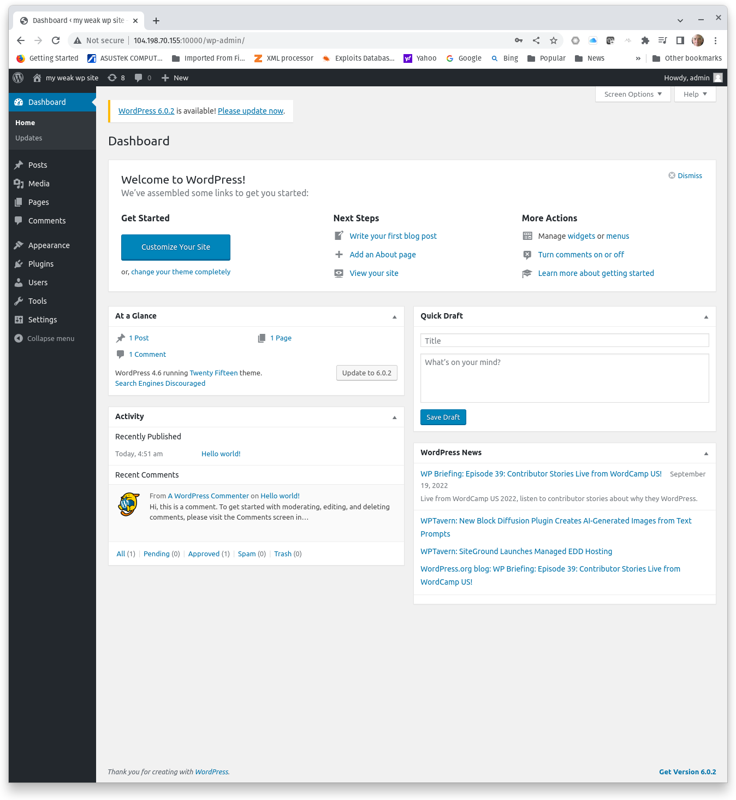
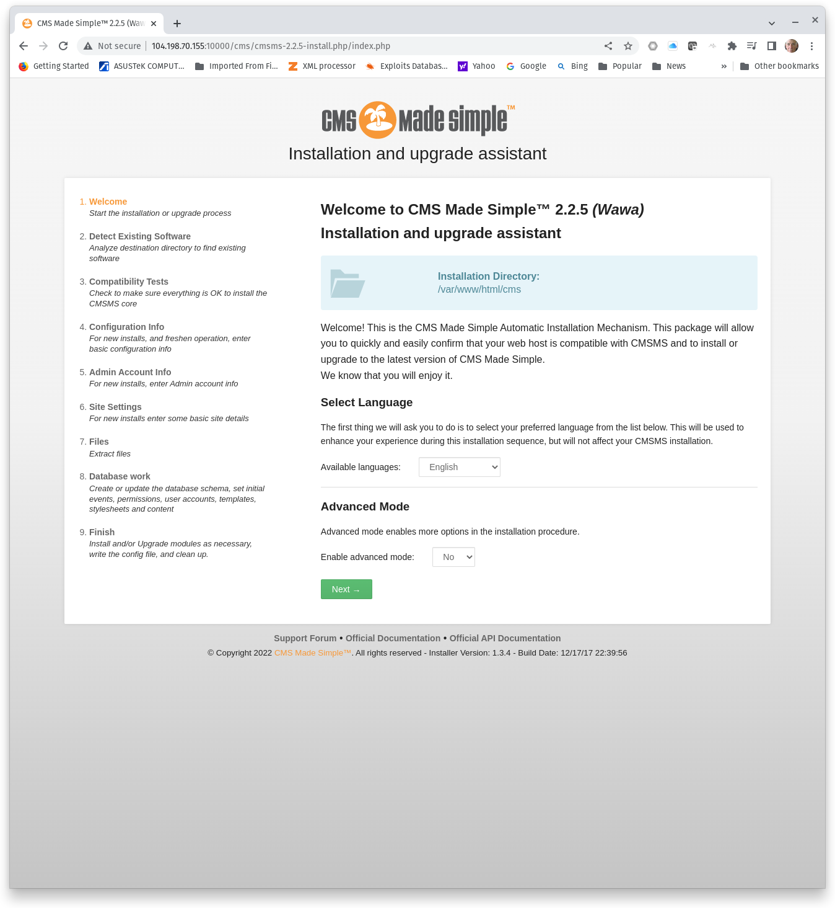
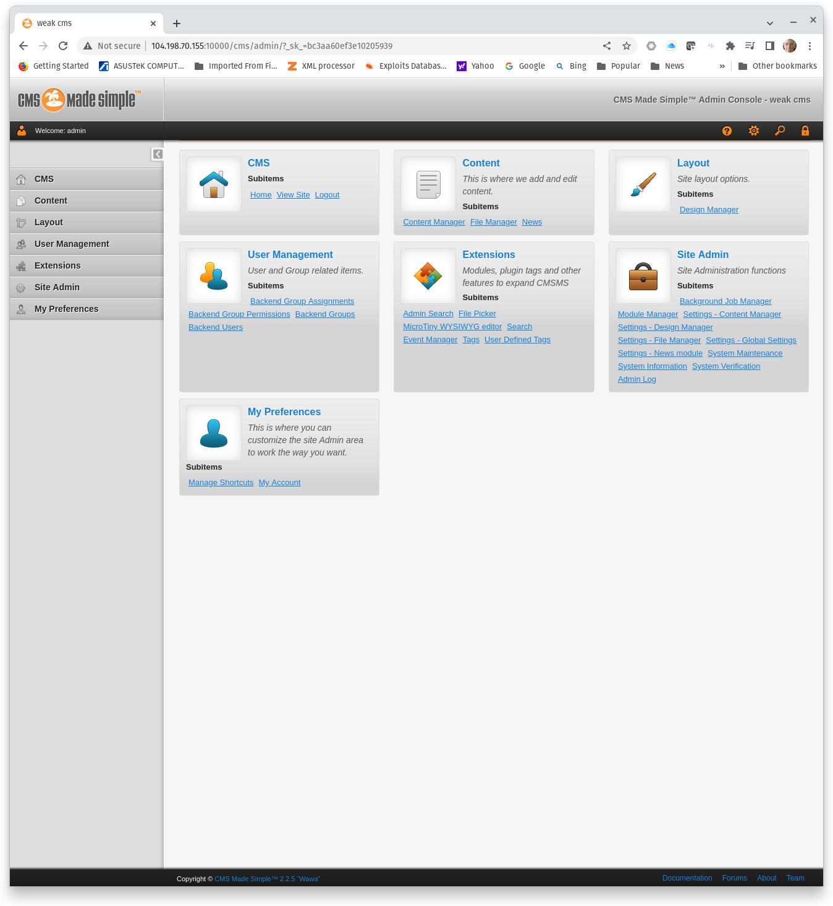

#  Web Application Enumeration - Vulnerability Scans

## Web application user enumeration and password attacks
This exercise introduces two additional tools for web application vulnerability testing: **wpscan** and **wfuzz**. 

Wpscan is a dedicated WordPress vulnerability scanner capable of detecting known vulnerabilities in the WordPress core and in WordPress plugins. Security in the ordPress core has been improved significantly over the years. Modern releases are well patched and well-known vulnerabilities have been effictively remediated. WordPress plugins are a different story. WordPress plugins are created by third-party developers. Most vulnerabilities in modern WordPress deployments are found in plugins, not the WordPress core. Wpscan tests both the core and plugins for known vulnerabilies.

Wfuzz is an http/https fuzzing tool that can be used for directory or resource enumeration and web application password attacks. This exercises focuses on web application password attacks using wfuzz.

## Collect information needed for installation
### Rockyou.txt
Kali Linux comes with a well-known list of compromised passwords, rockyou.txt. Initially, rockyou.txt is compressed in rockyou.txt.gz. We need to install **gunzip** and extract rockyou.txt before we can use it.

```
sudo apt update && sudo apt install gunzip -y
sudo gunzip /usr/share/wordlists/rockyou.txt.gz
```

Next, select a password from rockyou.txt. Technically, you could select any password in the file, but the further down the list you go to find a password, the longer it will take to crack that password. Therefore, we are going to look at passwords near the top of the list. The options below will return select passwords within the first 1500 lines of rockyou.txt. **Choose a password that will be used to for the WordPress admin account**.

```
head -n 1500 /usr/share/wordlists/rockyou.txt | grep marl
head -n 1500 /usr/share/wordlists/rockyou.txt | grep fat
head -n 1500 /usr/share/wordlists/rockyou.txt | grep goo
```

Next, we need the IP addresses for the wordpress and mysql containers. The IP addresses are configured in docker-compose.yml (see Challenge 1). **Examine docker-compose.yml and note the IP address for each container**.

## Building the lab

### Challenge 1: Build Wordpress
The target web applications will be build using Docker containers. The Docker containers and their networking configurations will be deployed using docker-compose. Docker-compose may not be installed on your server, so the first step is to install docker-compose.

```
sudo apt update &&  sudo apt install docker-compose -y
```

Configuration for Docker containers created with docker-compose are established in a .yml file. Although the .yml filename can be custom, the default filename for docker-compose configuration files is **docker-compose.yml**. We will use the default filename. Prepare your Ubuntu server:
1. Create a directory named **wordpress/**
2. In wordpress/ create the file **docker-compose.yml** and add the following to docker-compose.yml:

```
version: '2'
services:
 web:
   container_name: wordpress
   image: vulhub/wordpress:4.6
   depends_on:
    - mysql
   environment:
    - WORDPRESS_DB_HOST=mysql:3306
    - WORDPRESS_DB_USER=root
    - WORDPRESS_DB_PASSWORD=root
    - WORDPRESS_DB_NAME=wordpress
   ports:
    - "10000:80"
   networks:
     wpbr:
       ipv4_address: 172.19.0.3
 mysql:
   container_name: mysql
   image: mysql:5
   environment:
    - MYSQL_ROOT_PASSWORD=root
   networks:
     wpbr:
       ipv4_address: 172.19.0.4

networks:
  wpbr:
    driver: bridge
    ipam:
     config:
       - subnet: 172.19.0.0/24
         gateway: 172.19.0.1
```

Before we start the Docker containers, let's take a look at what docker-compose.yml does.
1. First, it creates two services, **web** and **mysql**. The containers will be named **wordpress** and **mysql** (refer to container_name), respectively. 
2. Second, it creates the a database named wordpress and configures the root user and root password (root/root) for the database.
3. Next, it creates a network dedicated to the wordpress and mysql containers and assigns static IP addresses on those containers. The static IP addresses will make it easier for us to create mysql users.
4. Last, it publishes TCP 80 on wordpress to TCP 10000 on the host.

Now we are ready to create the wordpress and mysql containers. Change directories to wordpress/.

From wordpress/, run start the containers using docker-compose:
```
sudo docker-compose up -d
sudo docker ps

CONTAINER ID   IMAGE                                COMMAND                  CREATED          STATUS          PORTS                                                                                  NAMES
ba16aad9143b   vulhub/wordpress:4.6                 "/usr/local/bin/dock…"   31 seconds ago   Up 30 seconds   0.0.0.0:10000->80/tcp, :::10000->80/tcp                                                wordpress
8dde72604dfe   mysql:5                              "docker-entrypoint.s…"   32 seconds ago   Up 31 seconds   3306/tcp, 33060/tcp                                                                    mysql
```
**Capture a screenshot of the running containers wordpress and mysql.**

### Challenge 2: Install the WordPress application
Challenge 1 started two services, a web service and its backend mysql service. However, the WordPress application is not yet installed. Start by browsing to TCP 10000 on your Ubuntu server to begin installation.


Follow the installation prompts to complete WordPress installation.

**WordPress installation details:**

|||
|---|---|
|**Site Title**|Your choice|
|**Username**|admin|
|**Password**|_Password chosen from rockyou.txt_|
|**Confirm Password**|Select checkbox to confirm weak password|
|**Your Email**|admin@local.net|
|**Search Engine Visibility**|Select check box to discourage search engines|

Click **Install WordPress**.

Finally, login as admin using the password you selected. Click **Login**. **Capture a screenshot of the admin panel.**



## Install CMS Made Simple
Install a second web applicaton on the WordPress server, CMS Made Simple 2.2.5. Download CMS Made Simple 2.2.5 from exploit-db and use the installation script to install the application. However, the database needs to be prepared before the application can be installed.

### Challenge 3: Prepare a database and user for CMS Made Simple 2.2.5
Before starting Challenge 3, **select another password from rockyou.txt**. Substitute that password for _your-password_.
Get a shell in the mysql server then:
1. Add a new database
2. Create a new user 
3. Grant privileges on the new database to the new user

```
sudo docker exec -it mysql bash

bash-4.2# mysql -u root -p
Enter password: root

  Welcome to the MySQL monitor.  Commands end with ; or \g.
  Your MySQL connection id is 18
  Server version: 5.7.39 MySQL Community Server (GPL)

  Copyright (c) 2000, 2022, Oracle and/or its affiliates.

  Oracle is a registered trademark of Oracle Corporation and/or its
  affiliates. Other names may be trademarks of their respective
  owners.

  Type 'help;' or '\h' for help. Type '\c' to clear the current input statement.

mysql> create database cms;
Query OK, 1 row affected (0.00 sec)

mysql> create user 'cms-user'@'172.19.0.3' identified by 'your-password';
Query OK, 0 rows affected (0.01 sec)

mysql> grant all privileges on cms.* to 'cms-user'@'172.19.0.3';
Query OK, 0 rows affected (0.08 sec)

mysql> exit
```

Test the new SQL user before installing CMS Made Simple 2.2.5. **Get a shell in wordpress and install mysql-client.**

```
sudo docker exec -it wordpress bash
apt update && apt install mysql-client unzip -y

mysql -u cms-user -p -h 172.19.0.4
Enter password: 
  Welcome to the MySQL monitor.  Commands end with ; or \g.
  Your MySQL connection id is 19
  Server version: 5.7.39 MySQL Community Server (GPL)

  Copyright (c) 2000, 2018, Oracle and/or its affiliates. All rights reserved.

  Oracle is a registered trademark of Oracle Corporation and/or its
  affiliates. Other names may be trademarks of their respective
  owners.

  Type 'help;' or '\h' for help. Type '\c' to clear the current input statement.

mysql> mysql> use cms;
Database changed

mysql> exit
```
We are ready to install CMS Made Simple 2.2.5. The applications will be downloaded from [exploit-db.com](https://www.exploit-db.com/exploits/44976).
**Get a shell in wordpress and ensure you are in directory /var/www/html.**

```
mkdir /var/www/html/cms && cd /var/www/html/cms
wget https://www.exploit-db.com/apps/a0cc942960d7e4998e791f911f9d7f6e-cmsms-2.2.5-install.zip
unzip a0cc942960d7e4998e791f911f9d7f6e-cmsms-2.2.5-install.zip && rm a0cc942960d7e4998e791f911f9d7f6e-cmsms-2.2.5-install.zip
chown -R www-data:www-data /var/www/html/cms/
```
Browse to http://your-Ubuntu-server-IP:10000/cms/cmsms-2.2.5-install.php



Continue through the install process. **Ignore the warning about PHP function configuration**.  

Configure the following **Database Information** details:
|||
|---|---|
|**Database Hostname**|mysql|
|**Database Name**|cms|
|**User name**|cms-user|
|**Password**|_The weak password chosen from rockyou.txt_|

Configure the following **Admin Account Information** details: **Before proceeding, select one more password from rockyou.txt**
|||
|---|---|
|**User name**|admin|
|**Email Address**|admin@local.net|
|**Password**|_The weak password chosen from rockyou.txt_|
|**Repeat Password**|_The weak password chosen from rockyou.txt_|

Finish the installation guide and click CMSMS admin panel. **Login as admin and take a screenshot of the CMSMS admin penel.**


